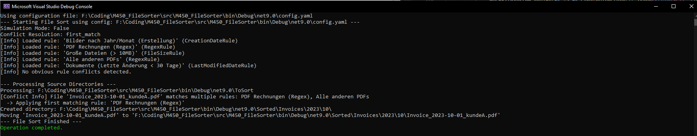

 
     

    <strong>File Sorter</strong> - YAML & Regex-driven automated file organization

    Define rules, let it sort.

    

---

## 🚀 What is File Sorter?

File Sorter monitors specified directories and automatically organizes files based on user-defined rules configured in a simple YAML file.

## 🖼️ Screenshots

    

## ✨ Features

- **YAML Configuration**: Easily define source directories and sorting rules in `config.yaml`.
- **Flexible Rules**: Sort files based on:
    - Creation Date
    - Last Modified Date
    - File Size
    - Regex pattern matching on filenames
- **Powerful Targeting**: Use placeholders (like `{yyyy}`, `{MM}`, `{$1}`) in target paths based on dates or regex capture groups.
- **Conflict Detection**: Identifies rules that might potentially clash or target the same destination.
- **Conflict Resolution**: Choose how to handle files matching multiple rules (`first_match`, `error`, `skip`, `log`).
- **SOLID & TDD Design**: Built with extensibility and testability in mind – adding new rule types is straightforward.
- **Simulation Mode**: Test your configuration without actually moving any files.

## 🔧 How It Works

File Sorter runs and performs the following steps:
1. Reads the `config.yaml` file to load source directories and sorting rules.
2. Scans the specified source directories for files.
3. For each file, evaluates all defined rules based on its metadata (name, size, dates).
4. Determines which rule(s) match the file.
5. Applies the configured conflict resolution strategy if multiple rules match.
6. Calculates the target directory based on the winning rule's template and file data.
7. Creates the target directory if it doesn't exist.
8. Moves the file to the calculated destination (unless in simulation mode).

## 📋 Getting Started

[Documentation](docs/docs.md) for installation and usage instructions.

---

Made with ❤️ by <a href="https://github.com/pianonic">PianoNic</a>

